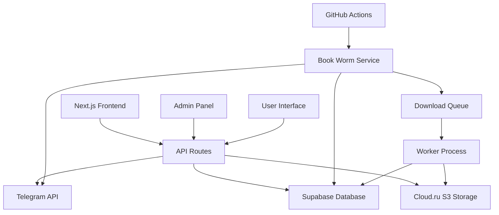
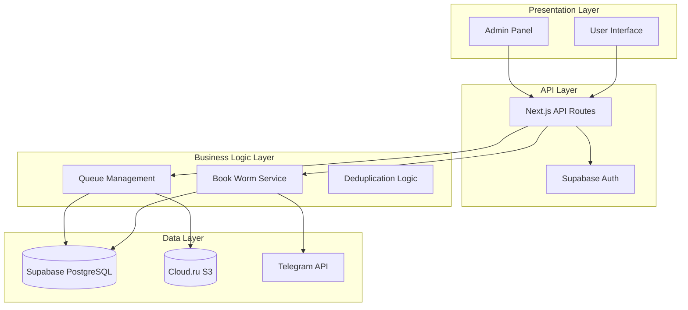

# Системные Паттерны: Fiction Library

## Архитектура

### Высокоуровневая Диаграмма



### Архитектурные Слои



## Ключевые Технические Решения

### Паттерн 1: Repository Pattern для Данных
**Описание**: Абстракция доступа к данным через репозитории
**Почему выбран**: Разделение бизнес-логики и доступа к данным, упрощение тестирования
**Как использовать**: 
- Создавать репозитории в `src/lib/repositories/`
- Использовать интерфейсы для абстракции
- Инжектировать зависимости через конструктор

```typescript
// Пример: src/lib/repositories/BookRepository.ts
interface IBookRepository {
  findById(id: string): Promise<Book | null>
  findByAuthor(author: string): Promise<Book[]>
  create(book: CreateBookDto): Promise<Book>
}
```

### Паттерн 2: Queue Pattern для Асинхронных Задач
**Описание**: Система очередей для обработки длительных операций
**Почему выбран**: Предотвращение таймаутов, масштабируемость, надежность
**Как использовать**:
- Добавлять задачи через `src/lib/queue/QueueManager.ts`
- Обрабатывать через worker процессы
- Использовать статусы для отслеживания прогресса

### Паттерн 3: Service Layer для Бизнес-Логики
**Описание**: Выделение бизнес-логики в отдельные сервисы
**Почему выбран**: Переиспользование логики, четкое разделение ответственности
**Как использовать**:
- Создавать сервисы в `src/lib/services/`
- Один сервис = одна область ответственности
- Инжектировать репозитории как зависимости

### Паттерн 4: Factory Pattern для Telegram Клиентов
**Описание**: Создание различных типов Telegram клиентов
**Почему выбран**: Различные конфигурации для разных каналов и задач
**Как использовать**:
- Использовать `TelegramClientFactory` в `src/lib/telegram/`
- Конфигурировать через переменные окружения
- Переиспользовать соединения

## Стандарты Кода

### Именование

#### Файлы и Папки
- **Компоненты React**: PascalCase (`BookCard.tsx`)
- **Утилиты и сервисы**: camelCase (`bookService.ts`)
- **API маршруты**: kebab-case (`book-details.ts`)
- **Папки**: kebab-case (`book-management/`)

#### Переменные и Функции
- **Переменные**: camelCase (`bookTitle`, `authorName`)
- **Константы**: SCREAMING_SNAKE_CASE (`MAX_FILE_SIZE`)
- **Функции**: camelCase (`getBookById`, `downloadFile`)
- **React компоненты**: PascalCase (`BookCard`, `AdminPanel`)

#### База данных
- **Таблицы**: snake_case (`books`, `download_queue`)
- **Колонки**: snake_case (`created_at`, `file_size`)
- **Индексы**: `idx_table_column` (`idx_books_author`)

### Структура файлов

```
src/
├── app/                    # Next.js App Router
│   ├── (auth)/            # Группа маршрутов с аутентификацией
│   ├── admin/             # Админ-панель
│   ├── api/               # API маршруты
│   └── globals.css        # Глобальные стили
├── components/            # React компоненты
│   ├── ui/               # Базовые UI компоненты (shadcn/ui)
│   ├── book/             # Компоненты для работы с книгами
│   └── admin/            # Компоненты админ-панели
├── lib/                   # Утилиты и сервисы
│   ├── services/         # Бизнес-логика
│   ├── repositories/     # Доступ к данным
│   ├── telegram/         # Telegram интеграция
│   ├── queue/            # Система очередей
│   └── utils/            # Вспомогательные функции
└── scripts/              # Исполняемые скрипты
```

### Обработка ошибок

#### Стандартный формат ошибок API
```typescript
interface ApiError {
  error: string
  message: string
  statusCode: number
  timestamp: string
}
```

#### Логирование
- **Уровни**: ERROR, WARN, INFO, DEBUG
- **Формат**: Структурированные JSON логи
- **Контекст**: Включать userId, requestId, операцию

```typescript
// Пример логирования
logger.error('Failed to download file', {
  fileId,
  userId,
  error: error.message,
  stack: error.stack
})
```

### TypeScript Конвенции

#### Интерфейсы и Типы
- **Интерфейсы**: Префикс `I` для абстракций (`IBookRepository`)
- **Типы**: Суффикс по назначению (`CreateBookDto`, `BookListResponse`)
- **Enums**: PascalCase (`BookStatus`, `QueueStatus`)

#### Строгость типов
- Использовать `strict: true` в tsconfig.json
- Избегать `any`, предпочитать `unknown`
- Использовать утилитарные типы (`Partial<T>`, `Pick<T, K>`)

### React Паттерны

#### Структура компонентов
```typescript
// Стандартная структура React компонента
interface BookCardProps {
  book: Book
  onDownload?: (bookId: string) => void
}

export function BookCard({ book, onDownload }: BookCardProps) {
  // Hooks
  const [isLoading, setIsLoading] = useState(false)
  
  // Event handlers
  const handleDownload = useCallback(() => {
    onDownload?.(book.id)
  }, [book.id, onDownload])
  
  // Render
  return (
    // JSX
  )
}
```

#### Хуки
- Кастомные хуки в `src/lib/hooks/`
- Префикс `use` для всех хуков
- Возвращать объект для множественных значений

### API Маршруты

#### Структура ответов
```typescript
// Успешный ответ
interface SuccessResponse<T> {
  data: T
  message?: string
}

// Ответ с пагинацией
interface PaginatedResponse<T> {
  data: T[]
  pagination: {
    page: number
    limit: number
    total: number
    totalPages: number
  }
}
```

#### Валидация входных данных
- Использовать Zod для валидации
- Валидировать на уровне API маршрутов
- Возвращать детальные ошибки валидации

## Паттерны Безопасности

### Аутентификация и Авторизация
- Использовать Supabase Auth для аутентификации
- Проверять роли на уровне API маршрутов
- Использовать RLS (Row Level Security) в Supabase

### Валидация данных
- Валидировать все входные данные
- Санитизировать пользовательский ввод
- Использовать параметризованные запросы

### Обработка файлов
- Проверять типы файлов
- Ограничивать размер файлов
- Сканировать на вредоносное ПО (при необходимости)

## Паттерны Производительности

### Кэширование
- Использовать Next.js кэширование для статических данных
- Кэшировать результаты поиска
- Использовать CDN для статических файлов

### Оптимизация запросов
- Использовать индексы в базе данных
- Пагинировать большие списки
- Использовать lazy loading для изображений

### Асинхронная обработка
- Выносить тяжелые операции в очереди
- Использовать streaming для больших файлов
- Показывать прогресс длительных операций