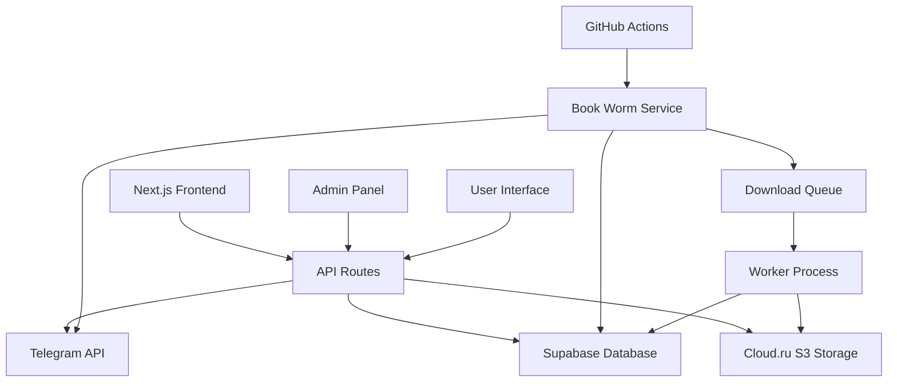
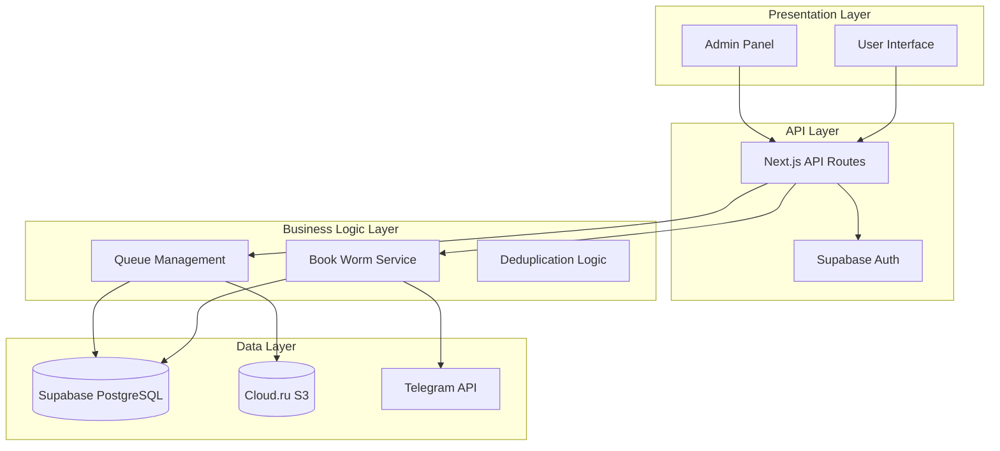
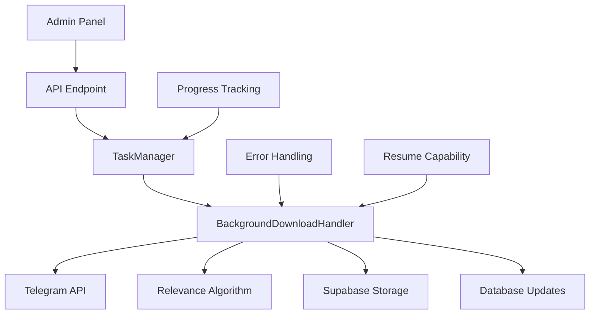

# Системные Паттерны: Fiction Library

## Архитектура

### Высокоуровневая Диаграмма


```mermaid
graph TD
    A[Next.js Frontend] --> B[API Routes]
    B --> C[Supabase Database]
    B --> D[Cloud.ru S3 Storage]
    B --> E[Telegram API]
    
    F[Book Worm Service] --> E
    F --> C
    F --> G[Download Queue]
    
    G --> H[Worker Process]
    H --> D
    H --> C
    
    I[Admin Panel] --> B
    J[User Interface] --> B
    
    K[GitHub Actions] --> F
```

### Архитектурные Слои


```mermaid
graph TB
    subgraph "Presentation Layer"
        UI[User Interface]
        ADMIN[Admin Panel]
    end
    
    subgraph "API Layer"
        API[Next.js API Routes]
        AUTH[Supabase Auth]
    end
    
    subgraph "Business Logic Layer"
        BOOKWORM[Book Worm Service]
        QUEUE[Queue Management]
        DEDUP[Deduplication Logic]
    end
    
    subgraph "Data Layer"
        DB[(Supabase PostgreSQL)]
        S3[(Cloud.ru S3)]
        TG[Telegram API]
    end
    
    UI --> API
    ADMIN --> API
    API --> AUTH
    API --> BOOKWORM
    API --> QUEUE
    BOOKWORM --> DB
    BOOKWORM --> TG
    QUEUE --> DB
    QUEUE --> S3
```

## Ключевые Технические Решения

### Паттерн 1: Repository Pattern для Данных
**Описание**: Абстракция доступа к данным через репозитории
**Почему выбран**: Разделение бизнес-логики и доступа к данным, упрощение тестирования
**Как использовать**: 
- Создавать репозитории в `src/lib/repositories/`
- Использовать интерфейсы для абстракции
- Инжектировать зависимости через конструктор

```typescript
// Пример: src/lib/repositories/BookRepository.ts
interface IBookRepository {
  findById(id: string): Promise<Book | null>
  findByAuthor(author: string): Promise<Book[]>
  create(book: CreateBookDto): Promise<Book>
}
```

### Паттерн 2: Паттерн Queue для Асинхронных Задач
**Описание**: Система очередей для обработки длительных операций
**Почему выбран**: Предотвращение таймаутов, масштабируемость, надежность
**Как использовать**:
- Добавлять и отслеживать задачи через текущие сервисы фоновой обработки, например `src/lib/task-manager.ts`
- Обрабатывать через worker-процессы
- Использовать статусы для отслеживания прогресса

### Паттерн 3: Слой Service для Бизнес-Логики
**Описание**: Выделение бизнес-логики в отдельные сервисы
**Почему выбран**: Переиспользование логики, четкое разделение ответственности
**Как использовать**:
- Создавать сервисы в `src/lib/services/`
- Один сервис = одна область ответственности
- Инжектировать репозитории как зависимости

### Паттерн 4: Паттерн Factory для Telegram клиентов
**Описание**: Создание различных типов Telegram клиентов в зависимости от задач
**Почему выбран**: Гибкость в работе с разными каналами и типами операций
**Как использовать**:
- Использовать `TelegramClientFactory` для создания клиентов
- Разные клиенты для метаданных и файлов
- Переиспользование соединений

### Паттерн 5: Единый алгоритм оценки файл→книга (book-file-scorer.ts)
**Описание**: Централизованная система оценки релевантности файла для книги, заменяет 3 старые дублирующиеся системы.
**Файл**: `src/lib/book-file-scorer.ts`
**Как использовать**: Единственный источник scoring-логики — все сервисы (BookWorm, file-linking, file-processing) импортируют `scoreFileToBook()` отсюда.

#### Принципы работы:

1. **Строгое разделение Author/Title через `parseFileName()`**:
   - Файл разбивается на `fileAuthor` + `fileTitle` по одному из разделителей: ` — `, ` – `, ` - `, `—`, `–`
   - Слова автора файла сравниваются ТОЛЬКО с словами автора книги
   - Слова названия файла сравниваются ТОЛЬКО с словами названия книги
   - Перекрёстное совпадение (автор файла ↔ название книги) **не даёт баллов**

2. **`checkAuthorMatch()`** — все слова из более короткого имени должны совпасть:
   - "Дем Михайлов" vs "Дем Михайлов" → 2/2 ✓
   - "Алексей" vs "Алексей Губарев" → 1/1 (короткое имя совпало полностью) ✓  
   - "Алексей" vs "Алексей Гришин" → 1/1 (короткое имя совпало, но автор match не даёт бонуса)

3. **Нормализация**:
   - NFC (`normalize('NFC')`) — превращает составные символы (`и + U+0306`) в `й`
   - Лемматизация через `src/lib/lemmatizer.ts` (с кэшем 10000 записей)
   - Удаление `ё` → `е`, нижний регистр

4. **нечеткоеMatch()**:
   - расстояние Левенштейна ≤ 2
   - **Первая буква должна совпадать** — `a[0] !== b[0]` → false (блокирует `роркх` ↔ `йорк`)

5. **Оценка (оценка 0–100)**:
   - Точное совпадение слова: +15
   - Нечёткое совпадение (нечеткое): +10
   - Бонус за совпадение всех слов названия: +10
   - Штраф за лишние слова: −5 (если слов меньше, несовпавшее слово книги −5)
   - Совпадение автора **не добавляет баллов** (проходит как бинарный флаг для UI)
   - Минимальный порог: **50**
   - Общие слова (`роман`, `эпопея`, `цикл`, `серия`, `fb2`, `ru` и т.д.) — не считаются лишними

6. **GENERIC_TITLE_WORDS**: `роман`, `эпопе`, `повест`, `рассказ`, `поэм`, `сказк`, `очерк`, `пьес`, `цикл`, `сери`, `книг`, `том`, `часть`, `сборник`, `fb2`, `pdf`, `epub`, `txt`, `ru`, `en`

#### Архитектура

```mermaid
graph TD
    A[parseFileName(rawName)] --> B[fileAuthor / fileTitle]
    B --> C[normalizeText + lemmatizeWords]
    C --> D[scoreTitleWords]
    C --> E[checkAuthorMatch]
    D --> F[totalScore]
    E --> F
    F --> G[scoreFileToBook]
    G --> H[return { score, matchedWords, authorMatch, ... }]
```

**Старые удалённые системы**: `UniversalFileMatcher`, старая оценка в `book-worm-service.ts`, дубли в `file-processing-service-enhanced.ts`. Всё заменено единым `book-file-scorer.ts`.

### Паттерн 6: Система дедупликации книг
**Описание**: Автоматическая и ручная система предотвращения и удаления дубликатов книг
**Почему выбран**: Поддержание качества данных и предотвращение засорения библиотеки
**Как использовать**:
- Интегрировать проверки в процесс синхронизации метаданных
- Запускать по расписанию через админ-панель
- Использовать скрипты для массовой очистки

#### Компоненты системы:
1. **Автоматическая дедупликация при синхронизации**:
   - Проверка каждой новой книги на дубликаты
   - Слияние данных: файлы, обложки, метаданные
   - Обновление существующих записей вместо создания дубликатов

2. **Нормализация текста для сравнения**:
   - Удаление годов в скобках "(2023)", "(2019)"
   - Удаление языковых индикаторов "ru", "en"
   - Приведение к нижнему регистру и очистка пробелов

3. **Планировщик дедупликации**:
   - Автоматический запуск по расписанию (5-1440 минут)
   - Обработка всех книг в базе данных
   - Приоритизация книг с файлами и полными метаданными

4. **Ручная дедупликация**:
   - Запуск через админ-панель
   - Режимы анализа и выполнения
   - Детальные отчеты о процессе

```typescript
// Пример использования сервиса дедупликации
import { BookDeduplicationService } from '@/lib/book-deduplication-service'

const duplicates = await BookDeduplicationService.checkForBookDuplicates(book)
const bestBook = BookDeduplicationService.selectBestBookFromDuplicates(duplicates)
```

### Паттерн 7: Асинхронная обработка файлов из Telegram
**Описание**: Система фоновой загрузки файлов с отслеживанием прогресса и возобновляемостью
**Почему выбран**: Предотвращение таймаутов, надежность, пользовательский опыт
**Как использовать**:
- Запускать через админ-панель или API-endpoint-ы
- Мониторить прогресс через TaskManager
- Использовать для массовой загрузки файлов

#### Архитектура асинхронной обработки:


```mermaid
graph TD
    A[Admin Panel] --> B[API Endpoint]
    B --> C[TaskManager]
    C --> D[BackgroundDownloadHandler]
    D --> E[Telegram API]
    D --> F[Relevance Algorithm]
    D --> G[Supabase Storage]
    D --> H[Database Updates]
    
    I[Progress Tracking] --> C
    J[Error Handling] --> D
    K[Resume Capability] --> D
```

#### Компоненты системы:
1. **TaskManager** (`src/lib/task-manager.ts`):
   - Отслеживание прогресса фоновых задач
   - Хранение статуса и результатов
   - Уникальные идентификаторы задач

2. **BackgroundDownloadHandler** (`src/lib/background-download.ts`):
   - Основная логика загрузки файлов
   - Интеграция с алгоритмом релевантности
   - Обработка ошибок и повторные попытки

3. **Возобновляемость процесса**:
   - Начало с последнего обработанного файла
   - Проверка существующих записей в `telegram_processed_messages`
   - Пропуск уже обработанных файлов

4. **Отслеживание прогресса**:
   - Реальное время отображения в админ-панели
   - Детальная статистика (успешно/ошибки/пропущено)
   - Логирование каждого шага обработки

```typescript
// Пример запуска асинхронной загрузки
import { TaskManager } from '@/lib/task-manager'
import { BackgroundDownloadHandler } from '@/lib/background-download'

const taskId = TaskManager.createTask('download-files', { limit: 100 })
const handler = new BackgroundDownloadHandler(taskId)
await handler.processFiles(100)
```

### Паттерн 8: Миграция файлов в Cloud.ru S3
**Описание**: Система миграции файлов из Supabase Storage в Cloud.ru S3 с локальным резервированием
**Почему выбран**: Оптимизация затрат, улучшение производительности, создание резервных копий
**Как использовать**:
- Выбирать подходящий скрипт в зависимости от сценария
- Всегда создавать локальные копии файлов
- Мониторить процесс через детальные логи

#### Типы миграции:
1. **Пошаговая миграция** (`migrate-to-cloud-ru.ts`):
   - Обработка файлов один за другим
   - Максимальная надежность
   - Подходит для production-среды

2. **Параллельная миграция** (`migrate-to-cloud-ru-concurrent.ts`):
   - Одновременная обработка до 5 файлов
   - Высокая скорость миграции
   - Требует стабильного интернет-соединения

3. **Загрузка архива Telegram** (`upload-telegram-archive.ts`):
   - Работа с распакованными архивами
   - Поддержка оригинальных имен файлов
   - Рекурсивное сканирование директорий

4. **Локальное резервное копирование** (`download-all-files-locally.ts`):
   - Создание полного локального бэкапа
   - Сохранение оригинальной структуры
   - Пропуск существующих файлов

#### Особенности реализации:
- **Локальные копии**: Все скрипты автоматически сохраняют файлы локально
- **Контроль нагрузки**: Настраиваемое количество одновременных операций
- **Детальное логирование**: Прогресс каждого файла с размером и статусом
- **Обработка ошибок**: Продолжение работы при ошибках отдельных файлов

### Паттерн 9: Планировщик задач для автоматизации
**Описание**: Система автоматического запуска синхронизации по расписанию через планировщики ОС
**Почему выбран**: Обеспечивает регулярное обновление библиотеки без ручного вмешательства
**Как использовать**:
- Настроить через Windows Task Scheduler или Linux Cron
- Использовать переменные окружения для настройки интервалов
- Настроить логирование для мониторинга

#### Рекомендуемые расписания:
- **Разработка**: Метаданные каждые 30 минут, файлы каждые 2 часа
- **Продакшен**: Метаданные ежедневно в 02:00, файлы еженедельно в воскресенье 03:00

```powershell
# Linux Cron пример
0 2 * * * curl -X POST https://your-host/api/admin/book-worm/auto-update -H "X-GitHub-Token: <token>"

# Windows Task Scheduler
# Программа: powershell.exe
# Аргументы: Invoke-RestMethod -Method Post -Uri https://your-host/api/admin/book-worm/auto-update -Headers @{"X-GitHub-Token"="<token>"}
```

### Паттерн 10: Полная синхронизация "Книжного Червя"
**Описание**: Интеллектуальная система проверки целостности данных и полной синхронизации при необходимости
**Почему выбран**: Предотвращает потерю данных, обеспечивает согласованность между Telegram и базой данных
**Как использовать**:
- Автоматически определяет необходимость полной синхронизации
- Выполняет проверку пропущенных сообщений
- Индексирует метаданные для быстрого поиска

#### Алгоритм принятия решений:
1. **Проверка необходимости полной синхронизации**:
   - Отсутствие записей в `telegram_processed_messages`
   - Наличие непроцессированных сообщений в канале
   - Расхождения между каналом и базой данных

2. **Выполнение полной синхронизации**:
   - Постраничная загрузка всех сообщений (по 100 за раз)
   - Обработка от новых к старым сообщениям
   - Парсинг метаданных с дедупликацией
   - Сопоставление файлов с книгами

3. **Нормальная синхронизация**:
   - Обработка только новых сообщений
   - Начало с последнего обработанного сообщения
   - Быстрая синхронизация изменений

#### Расширенная индексация метаданных:
- **Базовая индексация**: ID сообщения, автор, название
- **Поиск по ключевым словам**: Частичное совпадение с ранжированием
- **Статистика индекса**: Мониторинг качества данных

```typescript
// Пример использования полной синхронизации
import { BookWormService } from '@/lib/book-worm-service'

const bookWorm = new BookWormService()
const needsFullSync = await bookWorm.checkNeedsFullSync()

if (needsFullSync) {
  await bookWorm.performFullSync()
} else {
  await bookWorm.performNormalSync()
}
```

### Паттерн 11: Конфигурация Supabase для продакшена
**Описание**: Стандартизированная настройка Supabase проекта с миграциями и безопасностью
**Почему выбран**: Обеспечивает консистентность развертывания и безопасность данных
**Как использовать**:
- Использовать скрипты инициализации и развертывания
- Применять миграции для изменений схемы
- Настраивать RLS политики для безопасности

#### Структура проекта Supabase:
- `supabase/migrations/` - Миграции схемы базы данных
- `supabase/migrations_clean/` - Чистые миграции без устаревшего функционала
- `supabase/scripts/` - Скрипты развертывания и инициализации

#### Компоненты безопасности:
1. **Row Level Security (RLS)**: Включен на всех таблицах
2. **Ролевая модель**: 'reader' и 'admin' роли с соответствующими правами
3. **Storage политики**: Ограниченный доступ к файлам и обложкам
4. **Аутентификация**: Email/password с профилями пользователей

```sql
-- Пример RLS политики
CREATE POLICY "Users can view all books" ON books
  FOR SELECT USING (auth.role() = 'authenticated');

CREATE POLICY "Only admins can modify books" ON books
  FOR ALL USING (auth.jwt() ->> 'role' = 'admin');
```

#### Процесс развертывания:
```bash
# Инициализация нового проекта
./supabase/scripts/init.sh

# Развертывание в существующий проект
./supabase/scripts/deploy.sh

# Применение миграций
supabase db push

# Сброс базы данных (ВНИМАНИЕ: удаляет все данные)
supabase db reset
```

## Стандарты Кода

### Именование

#### Файлы и Папки
- **Компоненты React**: PascalCase (`BookCard.tsx`)
- **Утилиты и сервисы**: camelCase (`bookService.ts`)
- **API маршруты**: kebab-case (`book-details.ts`)
- **Папки**: kebab-case (`book-management/`)

#### Переменные и Функции
- **Переменные**: camelCase (`bookTitle`, `authorName`)
- **Константы**: SCREAMING_SNAKE_CASE (`MAX_FILE_SIZE`)
- **Функции**: camelCase (`getBookById`, `downloadFile`)
- **React компоненты**: PascalCase (`BookCard`, `AdminPanel`)

#### База данных
- **Таблицы**: snake_case (`books`, `download_queue`)
- **Колонки**: snake_case (`created_at`, `file_size`)
- **Индексы**: `idx_table_column` (`idx_books_author`)

### Структура файлов

```
src/
├── app/                    # Next.js App Router
│   ├── (auth)/            # Группа маршрутов с аутентификацией
│   ├── admin/             # Админ-панель
│   ├── api/               # API маршруты
│   └── globals.css        # Глобальные стили
├── components/            # React компоненты
│   ├── ui/               # Базовые UI компоненты (shadcn/ui)
│   ├── book/             # Компоненты для работы с книгами
│   └── admin/            # Компоненты админ-панели
├── lib/                   # Утилиты и сервисы
│   ├── services/         # Бизнес-логика
│   ├── repositories/     # Доступ к данным
│   ├── telegram/         # Telegram интеграция
│   ├── queue/            # Система очередей
│   └── utils/            # Вспомогательные функции
└── scripts/              # Исполняемые скрипты
```

### Обработка ошибок

#### Стандартный формат ошибок API
```typescript
interface ApiError {
  error: string
  message: string
  statusCode: number
  timestamp: string
}
```

#### Логирование
- **Уровни**: ERROR, WARN, INFO, DEBUG
- **Формат**: Структурированные JSON логи
- **Контекст**: Включать userId, requestId, операцию

```typescript
// Пример логирования
logger.error('Failed to download file', {
  fileId,
  userId,
  error: error.message,
  stack: error.stack
})
```

### TypeScript Конвенции

#### Интерфейсы и Типы
- **Интерфейсы**: Префикс `I` для абстракций (`IBookRepository`)
- **Типы**: Суффикс по назначению (`CreateBookDto`, `BookListResponse`)
- **Enums**: PascalCase (`BookStatus`, `QueueStatus`)

#### Строгость типов
- Использовать `strict: true` в tsconfig.json
- Избегать `any`, предпочитать `unknown`
- Использовать утилитарные типы (`Partial<T>`, `Pick<T, K>`)

### React Паттерны

#### Структура компонентов
```typescript
// Стандартная структура React компонента
interface BookCardProps {
  book: Book
  onDownload?: (bookId: string) => void
}

export function BookCard({ book, onDownload }: BookCardProps) {
  // Hooks
  const [isLoading, setIsLoading] = useState(false)
  
  // Event handlers
  const handleDownload = useCallback(() => {
    onDownload?.(book.id)
  }, [book.id, onDownload])
  
  // Render
  return (
    // JSX
  )
}
```

#### Хуки
- Кастомные хуки в `src/lib/hooks/`
- Префикс `use` для всех хуков
- Возвращать объект для множественных значений

### API Маршруты

#### Структура ответов
```typescript
// Успешный ответ
interface SuccessResponse<T> {
  data: T
  message?: string
}

// Ответ с пагинацией
interface PaginatedResponse<T> {
  data: T[]
  pagination: {
    page: number
    limit: number
    total: number
    totalPages: number
  }
}
```

#### Валидация входных данных
- Использовать Zod для валидации
- Валидировать на уровне API маршрутов
- Возвращать детальные ошибки валидации

## Паттерны Безопасности

### Аутентификация и Авторизация
- Использовать Supabase Auth для аутентификации
- Проверять роли на уровне API маршрутов
- Использовать RLS (Row Level Security) в Supabase

### Валидация данных
- Валидировать все входные данные
- Санитизировать пользовательский ввод
- Использовать параметризованные запросы

### Обработка файлов
- Проверять типы файлов
- Ограничивать размер файлов
- Сканировать на вредоносное ПО (при необходимости)

## Паттерны Производительности

### Кэширование
- Использовать Next.js кэширование для статических данных
- Кэшировать результаты поиска
- Использовать CDN для статических файлов

### Оптимизация запросов
- Использовать индексы в базе данных
- Пагинировать большие списки
- Использовать ленивую загрузку для изображений

### Асинхронная обработка
- Выносить тяжелые операции в очереди
- Использовать потоковую передачу для больших файлов
- Показывать прогресс длительных операций
 
# Обновление UI-паттерна - 2026-07-06

## Премиальный рабочий интерфейс

Основные поверхности приложения теперь следуют премиальному редакционно-продуктовому UI-направлению, а не старому декоративному fantasy/demo-направлению.

### Правила
- Использовать `Manrope` для основной UI-типографики: он поддерживает кириллицу и остается читаемым в плотных экранах админки и каталога.
- Держать продуктовую оболочку консистентной на `/library` и `/admin`: боковая навигация, sticky-верхняя панель, ограниченная ширина контента, компактные статусные поверхности.
- Для реальной работы с каталогом предпочитать плотные, легко сканируемые записи вместо чрезмерно крупных карточек.
- Использовать fantasy/enchanted-оформление только как опциональный опыт, а не как рабочий интерфейс по умолчанию.
- Избегать фиолетового свечения, декоративных градиентных сфер и крупных hero-first layout-ов на операционных страницах.
- Использовать тонкие OKLCH-токены бумага/чернила/латунь из `src/app/globals.css`.

### Текущие поверхности
- `src/components/layout/AppSidebar.tsx`: общая премиальная оболочка навигации.
- `src/app/library/page.tsx`: каталог, где поиск стоит первым, со статусными метриками и режимами просмотра.
- `src/components/books/advanced-search.tsx`: компактная панель фильтров.
- `src/components/books/book-card-large.tsx`: плотная запись книги в стиле списка.
- `src/components/modern/ModernBookCard.tsx`: спокойная карточка каталога для сетки.
- `src/app/admin/page.tsx`: оболочка операционного дашборда вокруг существующих компонентов синхронизации и индексации.

## Правила безопасного рендера в Chromium - 2026-07-06

Премиальный редизайн должен избегать известных Chromium-паттернов jitter-а compositor/repaint.

### Жесткие правила
- Не использовать `backdrop-blur` / `backdrop-filter` на продуктовых поверхностях, особенно рядом с элементами `position: sticky`.
- Не использовать `mix-blend-mode` для UI-поверхностей, которые могут двигаться, иметь hover, анимироваться или находиться за анимированными карточками.
- Не переключать `will-change: transform` на hover. Если compositor promotion действительно нужен, держать его стабильным и проверять, что он не вызывает layout shift.
- Для фоновой атмосферы предпочитать статические CSS-градиенты. Не подключать JS-слушатели `mousemove` для декоративного отслеживания градиента без конкретной продуктовой необходимости и проверки производительности.
- Hover-трансформации карточек нужно проверять в Chromium на repaint jitter, рассинхронизацию слоев и layout shift до того, как UI считается готовым.

### Причина
Chromium может рендерить `backdrop-blur` + sticky-элементы на CPU; `mix-blend-mode` может рассинхронизироваться с hover-трансформациями через отдельные compositing-слои; hover-переключаемый `will-change` может вызывать повторяющиеся циклы promotion/demotion. Эти приемы запрещены в проекте, если пользователь явно не одобрит исключение после визуальной проверки.

## Паттерн двухвкладочного рабочего пространства админки - 2026-07-06

Страница админки — рабочая поверхность, а не маркетинговая страница. Она использует один защищенный маршрут с двумя вкладками:

- `dashboard`: операционные элементы управления синхронизацией/индексацией, отчеты статуса, повторный вход Telegram и инструменты эмбеддингов.
- `file-linking`: плотный сценарий проверки связей файл-книга: очередь/поиск слева и сравнение кандидатов справа.

### Правила
- Держать общую оболочку админки в `src/app/admin/page.tsx`; UI проверки, специфичный для вкладки, должен жить в сфокусированных компонентах вроде `src/components/admin/file-linking-view.tsx`.
- Для основных режимов админки использовать сегментированные контролы с иконками вместо декоративных tab bar-ов.
- Высокосигнальные операционные метрики размещать в компактных плитках заголовка, а тело страницы оставлять под активный workflow.
- Для привязки файлов сохранять двухколоночную модель: сначала очередь/список книг, затем доказательства/действия по кандидатам.
- Карточки кандидатов должны показывать оценку, совпавшие слова, сигналы автор/название/message-id и действие в одном маршруте сканирования.
- Не использовать hover-трансформации, `backdrop-blur`, `mix-blend-mode`, hover-переключаемый `will-change` или JS mouse-follow-фоны в рабочем пространстве админки.

## Project Verification Rule - 2026-07-08

- Do not start the dev server in this project.
- Do not perform browser-based verification in this project.
- Before finishing UI/code changes, run Biome and `bun run build`.
- After successful verification, commit and push the changes when requested.
